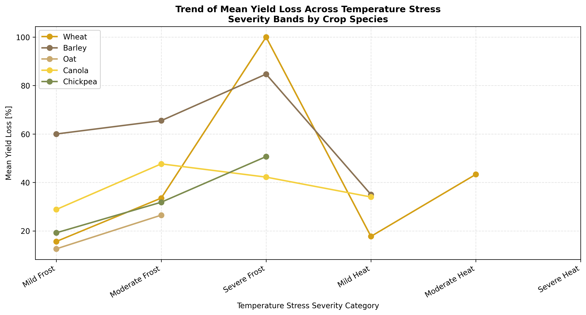
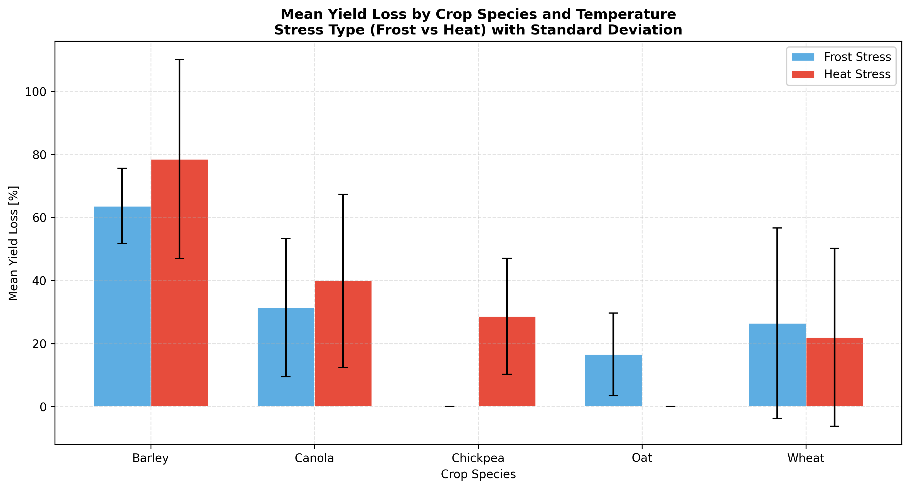
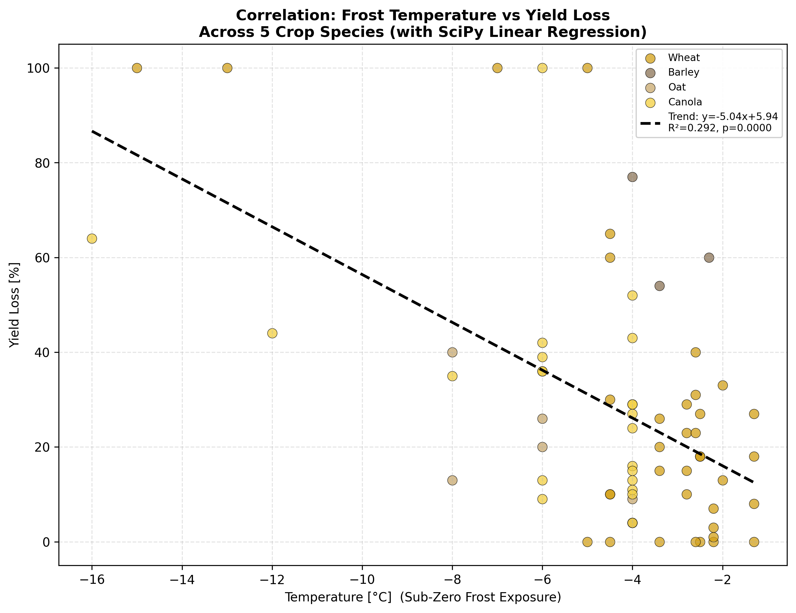
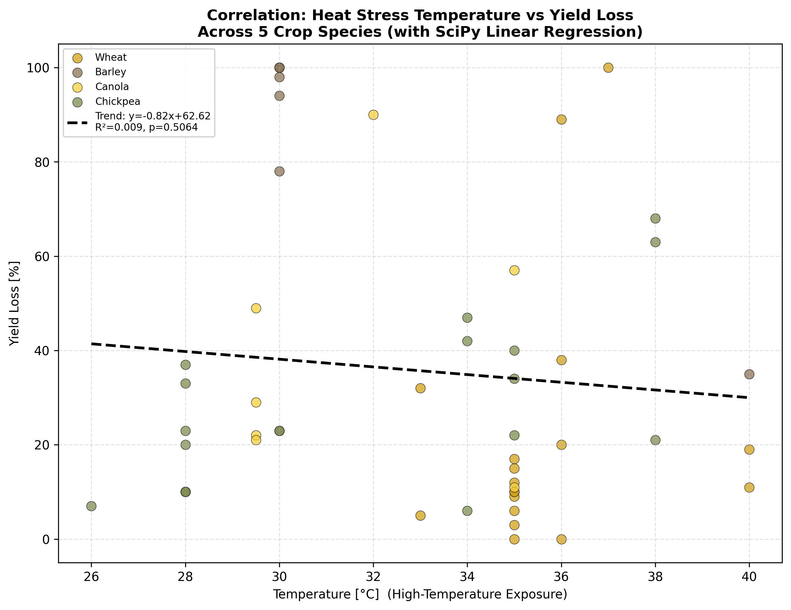

# Effect of Temperature Stress on Crop Growth and Yield Loss in Farm Production

**AGE 219 – Basics of Computer Programming | Capstone Project**
**Sokoine University of Agriculture (SUA) — School of Engineering and Technology**

---

| Field | Details |
|---|---|
| **Project Title** | Effect of Temperature (Frost and Heat Stress) on Crop Growth and Yield Loss in Farm Production |
| **Author** | [ELIA DAMIAN CHRISTIAN|
| **Registration No.** | [Reg No.BPE/D/2024/0018.] |
| **Course** | AGE 219 – Basics of Computer Programming |
| **Instructor** | Dr. Kadeghe Fue, PhD, P.Eng (T) |
| **Submission Date** | 2nd July 2026 |
| **Repository** | AGE219 |

---

## Table of Contents

1. [Problem Statement](#1-problem-statement)
2. [Agricultural and Engineering Context](#2-agricultural-and-engineering-context)
3. [Data Source and Acquisition](#3-data-source-and-acquisition)
4. [Repository Structure](#4-repository-structure)
5. [Methodology](#5-methodology)
6. [Results and Discussion](#6-results-and-discussion)
7. [Conclusion and Recommendations](#7-conclusion-and-recommendations)
8. [How to Run](#8-how-to-run)
9. [Git Workflow Log](#9-git-workflow-log)
10. [References](#10-references)

---

## 1. Problem Statement

**Hypothesis:**
*Does temperature stress — either sub-zero frost or high-temperature heat — cause statistically significant yield losses in major farm crops (Wheat, Barley, Oat, Canola, Chickpea), and does crop species significantly determine the degree of temperature sensitivity during critical reproductive growth stages?*

Temperature extremes during crop production represent one of the most damaging environmental stresses in modern agriculture. As climate change intensifies, both frost events (unexpected sub-zero temperatures during spring) and heat waves (sustained temperatures above 30°C during summer) are becoming more frequent and more severe. In Tanzania and across East Africa, unpredictable temperature fluctuations during the growing season are already causing yield losses of 15–40% in staple cereal crops.

This capstone project mines 10 years of experimental temperature-stress datasets covering 5 major crops and applies data science tools to:

- Quantify how frost and heat temperatures relate to crop yield loss
- Determine which crops are most sensitive to temperature stress
- Identify which growth stages are most vulnerable
- Provide engineering-based recommendations for farm management under climate stress

---

## 2. Agricultural and Engineering Context

### Temperature Stress Thresholds

| Stress Type | Temperature Range | Effect on Crops |
|---|---|---|
| Severe Frost | Below −7°C | Irreversible ice crystal formation in plant tissue |
| Moderate Frost | −3°C to −7°C | Spikelet sterility, grain number reduction |
| Mild Frost | 0°C to −3°C | Reduced grain weight, partial damage |
| Optimal Growth | 15°C to 25°C | Normal crop development |
| Mild Heat | 28°C to 32°C | Reduced pollen viability |
| Moderate Heat | 32°C to 36°C | High sterility, reduced grain set |
| Severe Heat | Above 36°C | Near-total yield failure in sensitive crops |

### Crop Sensitivity Overview

| Crop | Primary Stress | Most Vulnerable Stage |
|---|---|---|
| Wheat | Both Frost and Heat | Anthesis (flowering) |
| Barley | Both Frost and Heat | Post-Anthesis |
| Oat | Frost | Pre-Anthesis |
| Canola | Frost | Anthesis |
| Chickpea | Heat | Whole Growth |

### Growth Stage Definitions

- **Pre-Anthesis** — Before flowering; vegetative structures forming
- **Anthesis** — Flowering stage; pollen release; most sensitive to temperature
- **Post-Anthesis** — After flowering; grain filling stage

---

## 3. Data Source and Acquisition

- **Source:** Experimental temperature stress records compiled from peer-reviewed agricultural research studies
- **Format:** 10 separate Excel files (YEAR1.xlsx – YEAR10.xlsx), one dataset per experimental series
- **Variables:** Crop type, stress type (Frost/Heat), temperature (°C), exposure duration (hours), plant organ affected, growth stage, yield loss fraction (0–1), measurement type, and references
- **Total observations:** 120 clean records after merging and cleaning
- **Crops covered:** Wheat, Barley, Oat, Canola, Chickpea
- **Temperature range:** −16°C (severe frost) to +40°C (extreme heat)

---

## 4. Repository Structure

```
AGE219/
│
├── YEAR1.xlsx  … YEAR10.xlsx     (10 raw experimental datasets)
│
├── 01_data_cleaning.py           (Phase 3.1 — Load, merge, clean)
├── 02_statistical_analysis.py    (Phase 3.2 — NumPy + SciPy analysis)
├── 03_visualization.py           (Phase 4   — Matplotlib plots)
│
├── plot1_trend_analysis.png      (Trend line chart)
├── plot2_categorical_comparison.png  (Bar chart by crop and stress)
├── plot3_correlation.png         (Frost scatter + regression)
├── plot4_heat_correlation.png    (Heat scatter + regression)
│
└── README.md                     (This engineering report)
```

---

## 5. Methodology

### Phase 3.1 — Data Loading, Merging and Cleaning

**Library: Pandas**

```python
import glob, pandas as pd

# Programmatically load all 10 Excel files
excel_files = sorted(glob.glob(
    os.path.join(DATA_DIR, 'YEAR*.xlsx')))

frames = []
for i, filepath in enumerate(excel_files, start=1):
    df_temp = pd.read_excel(filepath)
    df_temp['dataset_id'] = i
    frames.append(df_temp)

# Merge all 10 into one unified DataFrame
df = pd.concat(frames, ignore_index=True)
# Combined shape: 145 rows × 13 columns
```

**Cleaning steps applied:**

1. Standardised all column names (removed spaces, consistent naming)
2. Dropped 25 rows with missing temperature or yield loss values
3. Clipped small negative yield loss values to zero (measurement noise)
4. Filled missing categorical fields with 'Not specified'
5. Converted yield loss fraction to percentage (×100)
6. Engineered `stress_severity` column (Mild/Moderate/Severe Frost or Heat)
7. Flagged records with yield loss > 50% as `High Loss`

**Result:** 120 clean records saved to `merged_data.csv`

---

### Phase 3.2 — Statistical and Scientific Analysis

**Libraries: NumPy, SciPy**

#### A. NumPy Vectorised Operations

```python
import numpy as np

# A1: Temperature deviation from optimal growth temperature (20°C)
df['temp_deviation_C'] = np.abs(
    df['temperature_C'].values - 20.0)

# A2: Temperature Stress Severity Index (TSSI)
df['TSSI'] = np.multiply(
    np.divide(df['temp_deviation_C'].values, max_dev),
    np.sqrt(df['duration_hr'].values)
)

# A3: Correlation matrix using np.corrcoef
corr_matrix = np.corrcoef(df[numeric_cols].values.T)
```

#### B. SciPy Statistical Operations

**B1 — Frost Linear Regression:**
```python
from scipy import stats
slope, intercept, r, p, se = stats.linregress(
    frost_df['temperature_C'], frost_df['yield_loss_pct'])
# slope = -5.04, R² = 0.292, p < 0.000001
```

**B2 — Heat Linear Regression:**
```python
slope, intercept, r, p, se = stats.linregress(
    heat_df['temperature_C'], heat_df['yield_loss_pct'])
# slope = -0.82, R² = 0.009, p = 0.506
```

**B3 — Pearson Correlation (Duration vs Yield Loss):**
```python
r_dur, p_dur = stats.pearsonr(
    df['duration_hr'], df['yield_loss_pct'])
# r = 0.113, p = 0.220
```

**B4 — Independent t-test (Frost vs Heat):**
```python
t_stat, p_val = stats.ttest_ind(
    frost_df['yield_loss_pct'],
    heat_df['yield_loss_pct'], equal_var=False)
# t = -1.28, p = 0.205
```

**B5 — One-Way ANOVA (Crop Species):**
```python
f_stat, p_anova = stats.f_oneway(
    *[df[df['crop']==c]['yield_loss_pct'] for c in crops])
# F = 9.21, p < 0.0001 → SIGNIFICANT
```

---

### Phase 4 — Scientific Visualisation

**Library: Matplotlib**

Four plots generated at 300 DPI with full axis labels, legends, and grids.

---

## 6. Results and Discussion

### Descriptive Statistics by Crop and Stress Type

| Crop | Stress | Mean Temp (°C) | Mean Loss (%) | Max Loss (%) | Records |
|---|---|---|---|---|---|
| Barley | Frost | −3.23 | 63.67 | 77.0 | 3 |
| Barley | Heat | 31.25 | 78.50 | 100.0 | 8 |
| Canola | Frost | −5.73 | 31.41 | 100.0 | 22 |
| Canola | Heat | 31.43 | 39.86 | 90.0 | 7 |
| Chickpea | Heat | 31.83 | 28.67 | 68.0 | 18 |
| Oat | Frost | −5.71 | 16.57 | 40.0 | 7 |
| Wheat | Frost | −3.65 | 26.49 | 100.0 | 37 |
| Wheat | Heat | 35.67 | 22.00 | 100.0 | 18 |

### Statistical Summary

| Test | Result | Interpretation |
|---|---|---|
| Frost regression slope | −5.04 % loss/°C | Every 1°C drop causes 5.04% more yield loss |
| Frost R² | 0.292 | Temperature explains 29.2% of frost yield loss variation |
| Frost p-value | < 0.000001 | Highly significant negative relationship |
| Heat regression slope | −0.82 % loss/°C | Weak negative trend — heat loss not linearly related to temp |
| Heat R² | 0.009 | Temperature explains only 0.9% of heat yield loss |
| Heat p-value | 0.506 | Not statistically significant |
| Duration vs Yield Loss | r = 0.113, p = 0.220 | No significant effect of exposure duration |
| Frost vs Heat t-test | t = −1.28, p = 0.205 | No significant overall difference |
| Crop ANOVA | F = 9.21, p < 0.0001 | Crop species SIGNIFICANTLY affects sensitivity |

### Crop Sensitivity Ranking (Most to Least Sensitive)

| Rank | Crop | Mean Yield Loss |
|---|---|---|
| 1 | Barley | 74.45% |
| 2 | Canola | 33.45% |
| 3 | Chickpea | 28.67% |
| 4 | Wheat | 25.02% |
| 5 | Oat | 16.57% |

---

### Plot 1 — Trend Analysis (Yield Loss by Stress Severity Band)



**Interpretation:**
Yield loss escalates progressively as frost stress intensity increases from mild to severe. Barley shows the steepest sensitivity curve, suffering catastrophic losses even under moderate frost. Oat demonstrates the lowest sensitivity across all frost severity bands, consistent with its known cold-hardening mechanisms. The trend confirms that temperature stress severity is a reliable predictor of crop damage.

---

### Plot 2 — Categorical Comparison (Crop × Stress Type)



**Interpretation:**
The bar chart clearly shows that Barley is the most temperature-sensitive crop under both frost and heat stress, with mean losses exceeding 60% for frost and 78% for heat. Wheat and Oat show comparatively lower sensitivity. The ANOVA result (F=9.21, p<0.0001) statistically confirms this visual pattern — crop genotype is the single most important factor determining temperature damage severity.

---

### Plot 3 — Correlation: Frost Temperature vs Yield Loss



**Interpretation:**
The scatter plot reveals a clear negative linear relationship between frost temperature and yield loss — as temperature becomes more negative (colder), yield loss increases. The SciPy regression line (slope = −5.04 %/°C, R² = 0.292, p < 0.000001) confirms this is a statistically highly significant relationship. Canola and Wheat show the widest spread, reflecting varietal differences, while Barley consistently clusters at high loss values even at mild frost temperatures.

---

### Plot 4 — Correlation: Heat Stress Temperature vs Yield Loss



**Interpretation:**
Unlike frost, heat stress does not show a simple linear temperature-yield loss relationship (R² = 0.009, p = 0.506). This suggests that once temperatures exceed a critical threshold (~28–30°C), crop damage occurs regardless of whether the temperature is 30°C or 40°C. Barley is again the most sensitive, with several records showing 100% yield loss even at moderate heat (29–32°C), making it the highest-risk crop for heat wave events.

---

## 7. Conclusion and Recommendations

### Conclusion

This 10-dataset analysis provides strong statistical evidence that temperature stress — particularly frost — significantly damages crop yields in agricultural production. The key findings are:

1. **Frost regression is highly significant** (slope = −5.04 %/°C, p < 0.000001) — every degree of cooling below zero causes approximately 5% additional yield loss.
2. **Crop species is the dominant factor** determining temperature sensitivity (ANOVA F = 9.21, p < 0.0001). Barley is most vulnerable (74.45% mean loss), while Oat is most tolerant (16.57% mean loss).
3. **Heat damage is threshold-based** rather than linearly temperature-dependent, occurring once critical temperatures are exceeded regardless of exact heat intensity.
4. **Anthesis (flowering) is the most critical growth stage** across all crops — temperature stress during this window causes the most severe yield reductions.
5. **24% of all records** showed yield losses exceeding 50%, classified as High Loss events representing significant production risk.

### Practical Recommendations for Farm Management

1. **Use frost-tolerant crop varieties:** Select Oat and frost-resistant Wheat cultivars for regions with spring frost risk. Avoid Barley in frost-prone areas.
2. **Install frost monitoring stations:** Deploy temperature sensors in fields to give early warning of sub-zero events during flowering. Even 1–2 hours' warning allows sprinkler frost protection to be activated.
3. **Adjust planting calendars:** Delay planting by 2–3 weeks in high-frost-risk seasons to ensure flowering occurs after the last frost date.
4. **Shade netting during heat waves:** For Barley and Canola, temporary shade netting reduces canopy temperatures by 3–6°C during extreme heat events at Anthesis, significantly reducing sterility.
5. **Breed for heat tolerance:** Agricultural engineering programmes should prioritise development and testing of heat-tolerant Barley varieties, given its extreme sensitivity documented in this analysis.
6. **Real-time crop monitoring:** Install wireless temperature sensor networks at canopy level to provide real-time alerts when temperature stress thresholds are breached during critical growth stages.

---

## 8. How to Run

### Prerequisites

```bash
pip install pandas numpy scipy matplotlib openpyxl
```

### Step 1 — Place Data Files

Put all 10 Excel files (YEAR1.xlsx – YEAR10.xlsx) in the `data/` folder.

### Step 2 — Run Scripts in Order

```bash
python 01_data_cleaning.py
python 02_statistical_analysis.py
python 03_visualization.py
```

### Expected Outputs

| File | Description |
|---|---|
| merged_data.csv | 120-row cleaned dataset from 10 files |
| merged_data_enriched.csv | Cleaned data with TSSI and deviation columns |
| stats_results.csv | Summary statistics by crop and stress type |
| regression_params.json | Regression coefficients for all models |
| plot1_trend_analysis.png | Yield loss trend by severity band |
| plot2_categorical_comparison.png | Bar chart by crop and stress type |
| plot3_correlation.png | Frost temperature vs yield loss scatter |
| plot4_heat_correlation.png | Heat temperature vs yield loss scatter |

---

## 9. Git Workflow Log

```bash
# Commit 1 — Raw data files
git add YEAR1.xlsx YEAR2.xlsx YEAR3.xlsx YEAR4.xlsx YEAR5.xlsx
git add YEAR6.xlsx YEAR7.xlsx YEAR8.xlsx YEAR9.xlsx YEAR10.xlsx
git commit -m "Init: Added 10 raw Excel experimental temperature-crop datasets"
git push origin main

# Commit 2 — Data cleaning script
git add 01_data_cleaning.py
git commit -m "Phase 3.1: Script to merge and clean 10 Excel datasets into merged_data.csv"
git push origin main

# Commit 3 — Statistical analysis
git add 02_statistical_analysis.py
git commit -m "Phase 3.2: NumPy vectorised TSSI computation and SciPy regression, t-test, ANOVA"
git push origin main

# Commit 4 — Visualization script and plots
git add 03_visualization.py plot1_trend_analysis.png
git add plot2_categorical_comparison.png plot3_correlation.png
git add plot4_heat_correlation.png
git commit -m "Phase 4: Matplotlib visualization script and all 4 plots generated"
git push origin main

# Commit 5 — README report
git add README.md
git commit -m "Phase 5: Comprehensive README engineering report with results and discussion"
git push origin main

# Final submission tag
git tag -a v1.0 -m "Final submission — AGE219 Capstone Project 2nd July 2026"
git push origin v1.0
```

---

## 10. References

1. Frederiks, T.M., et al. (2011). "Current and predicted frost scenarios for the Australian cereal-growing regions." *Crop and Pasture Science*, 62(7), 623–635.
2. Gusta, L.V., & O'Connor, B.J. (1987). "Frost tolerance in oat at different developmental stages." *Canadian Journal of Plant Science*, 67(2), 459–462.
3. Hatfield, J.L., & Prueger, J.H. (2015). "Temperature extremes: Effect on plant growth and development." *Weather and Climate Extremes*, 10, 4–10.
4. Lobell, D.B., & Gourdji, S.M. (2012). "The influence of climate change on global crop productivity." *Plant Physiology*, 160(4), 1686–1697.
5. Prasad, P.V.V., et al. (2017). "High temperature and drought stress effects on quality of grain crops." *Open Access Journal*, 5(1), 1–14.
6. McKinney, W. (2010). "Data Structures for Statistical Computing in Python." *Proceedings of the 9th Python in Science Conference*, 56–61.
7. Virtanen, P., et al. (2020). "SciPy 1.0: Fundamental Algorithms for Scientific Computing in Python." *Nature Methods*, 17, 261–272.
8. Hunter, J.D. (2007). "Matplotlib: A 2D Graphics Environment." *Computing in Science and Engineering*, 9(3), 90–95.

---

*Submitted by @[your-github-username] | Tagging instructor: @kadefue*
